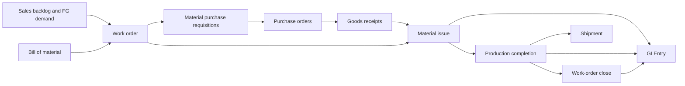

# Manufacturing Process

**Audience:** Students, instructors, analysts, and contributors who need to understand how production works in the current dataset.  
**Purpose:** Explain the manufacturing flow in plain language and connect it to the database tables and accounting entries.  
**What you will learn:** How Greenfield plans production, issues materials, completes finished goods, closes work orders, and links manufacturing to purchasing, inventory, and the ledger.

> **Implemented in current generator:** Single-level BOMs, manufacturing work orders, material issues, production completions, work-order close, factory overhead journals, manufacturing conversion reclass journals, and manufacturing variance accounting.

> **Planned future extension:** Payroll subledger detail, labor-time capture, routings, and deeper production planning.

## Business Storyline

Greenfield does not manufacture every product it sells.

Instead, it produces a selected subset of furniture, lighting, and some textile items in-house. When customer demand and finished-goods buffers indicate a shortage, the manufacturing team releases work orders. Raw materials and packaging are issued to production, completed finished goods move into inventory, and accounting closes the work order when actual and standard costs are fully resolved.

## Process Diagram

In plain language:

- customer demand helps determine when new production is needed
- BOMs define which components are required
- purchasing replenishes raw materials and packaging
- production issues components into WIP
- completed goods move into finished-goods inventory
- work-order close pushes remaining differences into manufacturing variance

## Step-by-Step Walkthrough

### 1. Define the standard recipe

Each manufactured finished good has one active BOM. The BOM lists raw-material and packaging components plus standard component quantities and scrap factors.

Main tables:

- `BillOfMaterial`
- `BillOfMaterialLine`
- `Item`

### 2. Release a work order

Work orders are created for manufactured items when projected shortage exists after considering:

- open sales backlog
- available finished-goods inventory
- scheduled open completions
- a target finished-goods buffer

Main table:

- `WorkOrder`

### 3. Replenish components through P2P

If the planned work order needs more materials than current stock supports, the generator creates purchasing demand through `PurchaseRequisition`. Those requisitions move through the normal P2P process into purchase orders and goods receipts.

Main linked tables:

- `PurchaseRequisition`
- `PurchaseOrder`
- `GoodsReceipt`

### 4. Issue components to production

When work begins, raw materials and packaging are issued from warehouse inventory into WIP.

Main tables:

- `MaterialIssue`
- `MaterialIssueLine`

Accounting event:

- debit `1046` Inventory - Work in Process
- credit `1045` Inventory - Materials and Packaging

### 5. Complete finished goods

Completed production moves finished goods into inventory at standard material plus standard conversion cost.

Main tables:

- `ProductionCompletion`
- `ProductionCompletionLine`

Accounting event:

- debit `1040` Inventory - Finished Goods
- credit `1046` Inventory - Work in Process
- credit `1090` Manufacturing Cost Clearing

### 6. Close the work order

When the generator determines the work order is ready to close, residual material and conversion differences are closed to manufacturing variance.

Main table:

- `WorkOrderClose`

Accounting event:

- residual WIP and clearing balances move to `5080` Manufacturing Variance

### 7. Ship the completed goods

Once finished goods are in inventory, normal O2C shipments can consume them.

## Main Tables Involved

| Table | Role |
|---|---|
| `Item` | Identifies which sellable items are purchased versus manufactured |
| `BillOfMaterial` | BOM header for manufactured items |
| `BillOfMaterialLine` | BOM component detail |
| `WorkOrder` | Production order for a manufactured item |
| `MaterialIssue` | Header for component issue to production |
| `MaterialIssueLine` | Component issue detail |
| `ProductionCompletion` | Header for finished-goods completion |
| `ProductionCompletionLine` | Finished-goods completion detail |
| `WorkOrderClose` | Variance close and work-order closure record |

## When Accounting Happens

Manufacturing creates both operational and journal-driven accounting:

- `MaterialIssue` posts WIP and materials inventory
- `ProductionCompletion` posts finished goods, WIP, and manufacturing clearing
- `WorkOrderClose` posts manufacturing variance
- recurring journals also include:
  - `Factory Overhead`
  - `Manufacturing Conversion Reclass`

## Common Student Questions

- Which products are manufactured and which are purchased?
- What materials go into a manufactured item?
- Which work orders stayed open at period end?
- How much material was issued compared with standard requirement?
- How much manufacturing variance was posted by month or item group?
- How does production activity affect finished-goods availability and shipments?

## Current Implementation Notes

- The current model is intentionally a foundation:
  - single-level BOMs only
  - no routings or work centers
  - no labor-time capture
  - no subassemblies
- Manufacturing demand is linked to sales backlog and finished-goods inventory logic.
- Raw-material replenishment uses the existing P2P flow instead of a separate procurement subsystem.

## Where to Go Next

- Read [p2p.md](p2p.md) to see how materials enter inventory.
- Read [o2c.md](o2c.md) to see how finished goods leave inventory.
- Read [../reference/posting.md](../reference/posting.md) for the detailed accounting rules.
